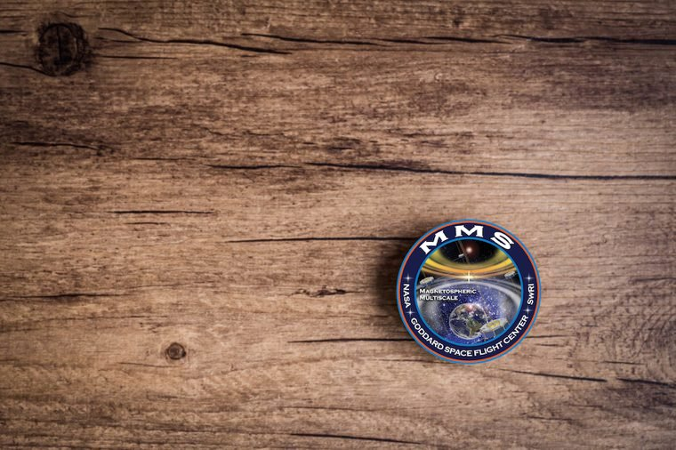

# The MMS Event Explorer (MeMeS)

[MeMeS](https://heliohackweek.github.io/mms_data_hunt/) is a Python-based collaborative project incorporating research performed during the [2020 Helio HackWeek](https://heliohackweek.github.io/), hosted by the [NASA Center for Climate Simulation](https://www.nccs.nasa.gov/), the University of Washington [eScience Institute](https://geog.umd.edu/), [NVIDIA](https://www.nvidia.com/), and the University of Maryland [Department of Geographical Sciences](https://geog.umd.edu/).

### Contents

1. [Project Objective](#project-objective)
2. [Development](#development)
3. [Contributing and Resources](#contributing-and-resources)

<!--
2. Information/Contact/Resources
3. Use
4. Development
    - Step 0:
    - Step 1:
4. Contributing
-->

---

# Project Objective

To contribute to the scientific community a research-aiding utility that identifies characteristic Heliophysical events within the Magnetospheric Multiscale (MMS) mission observation record using identified events from Scientists in the Loop (SITL) reports as the ground-truth training set for machine learning training and event selection.

---

# Development

Development of a project is not always linear and with varying degrees of skill and knowledge one may be more interested in contributing to different portions of this single effort. Below, are possible paths of development that have been envisioned for this particular scope of a 3-day programming sprint and out of scope development for future collaboration:

- __Step 0:__ Process SITL Reports __(currently in progress)__
  - __Step 0.1:__ Build the ground-truth database
    1. Retrieve ASCII reports from [Berkeley](https://www.ssl.berkeley.edu/~moka/eva/sitl_report.html) in a programmatic way.
        - _(out of scope)_: Create a RESTFul, web-based API that allows scientists to search for events.
    2. Parse reports to obtain records of BBF and DF events.
        - _(out of scope)_: Create a machine learning algorithm to pick up more events based upon case sensitivity, misspelling, and typographic errors. For now, a 1-year record of exact (or minimal variations) phrase occurances will suffice.
    3. Store results in a database for future use and organization.
        - _(out of scope)_: Weigh the options of SQL and SQL-less types of storage. For now, a SQLite file-based database will suffice.
    4. _(out of scope)_: Automate process for future reports as well as process full record of reports.
    5. _(out of scope)_: Create a standardized mechanism and format for reporting.
  - __Step 0.2:__ Frontend work
    1. _(out of scope):_ Website with sarch that queries database based upon event type, date range, or last N events.
    2. _(out of scope):_ API underneath website so researchers can also grab event information from database using HTTP methods.
    3. _(out of scope):_ Visually map events to xy and yz planes for visual representation and identification.
    4. _(out of scope):_ Add functionality of mapping/visualualizations to show data layers or with slight transparency.
    5. _(out of scope):_ Extend to produce a catalog of all events reported (beyond BBF and DF).
- __Step 1:__ Event Finder
  - __Step 1.1:__ Build a Python package to search MMS data for events.
    1. Use [pyspedas](https://github.com/spedas/pyspedas) to retrieve/stream data for specific dates and times reported from a sample CSV file from SITL database of reports.
    2. Identify specific type of observation from MMS needed to identify/characterize events.
    3. Put data in a Pandas dataframe or structure in a more Python way.
    4. Manipulate data to identify event duration, magnitude, location, and observational files used.
    5. Add event information to corresponding event record within SITL database to reference data, imagery, and other useful information (metadata or resources).
  - __Step 1.2:__ Use ML to find similar type of events for a different time period.
    1. Once a small subset of events have been confirmed from the data, a training set will be created for each event type.
    2. Use of tensorflow (specifically requested by scientists) to produce results of similar events within the spanse of observational records.
    3. Optimize algorithm to optimize resource use and I/O overhead.
  - __Step 1.3:__ Use GPU processing to optimize ML techniques
    1. Use RAPIDS on NVIDIA resources to expedite processing of data for events
    2. Build optimized algorithms to sift through large amounts of data for analysis

---

## Contributing and Resources

Thank you for your interest in this project! We welcome pull requests from developers of all skill levels. To get started, simply fork the master branch on GitHub to your personal account and then clone the fork into your development environment.

<!--
https://github.com/AstroHackWeek/pr_review_tutorial
https://github.com/AstroHackWeek/AstroHackWeek2019/wiki/Cloud-Resources-for-Deep-Learning-(GPUs)
https://github.com/AstroHackWeek/AstroHackWeek2019/wiki/Advice-for-Teachers
https://github.com/AstroHackWeek/AstroHackWeek2019/wiki
https://github.com/AstroHackWeek/AstroHackWeek2019/tree/master/day2_software
https://github.com/AstroHackWeek/AstroHackWeek2019/wiki/The-Hacker's-Guide-to-Hacking
https://github.com/AstroHackWeek/AstroHackWeek2019/wiki/Software-Stack
https://github.com/AstroHackWeek/AstroHackWeek2019/wiki/Hacking-Central
https://github.com/AstroHackWeek/AstroHackWeek2019/wiki/Hack-Template
https://github.com/AstroHackWeek/AstroHackWeek2019/wiki/Detailed-Schedule
https://github.com/AstroHackWeek/AstroHackWeek2019/wiki/Breakouts
https://github.com/AstroHackWeek/AstroHackWeek2019/wiki/Advice-for-Teachers
https://github.com/AstroHackWeek/AstroHackWeek2019
https://github.com/AstroHackWeek
-->
